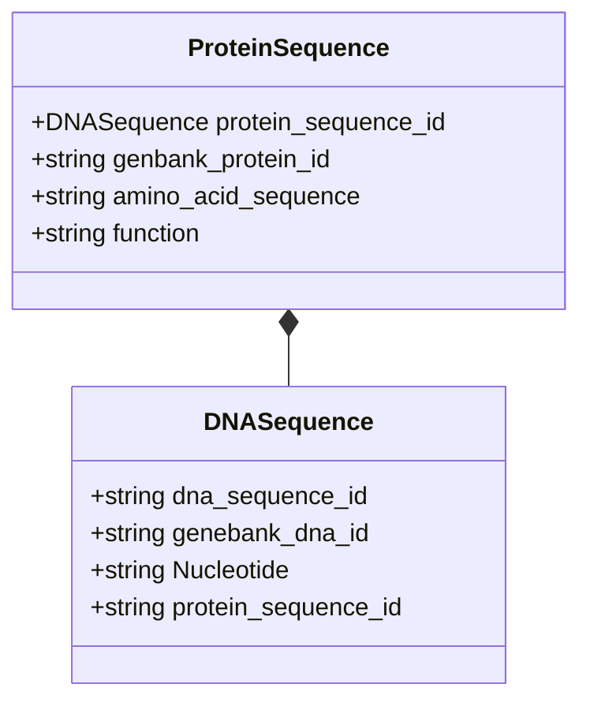

```mermaid
classDiagram
    ProteinSequence *-- DNASequence
    
    class ProteinSequence {
        +DNASequence protein_sequence_id
        +string genbank_protein_id
        +string amino_acid_sequence
        +string function
    }
    
    class DNASequence {
        +string dna_sequence_id
        +string genebank_dna_id
        +string Nucleotide
        +string protein_sequence_id
    }
    
```