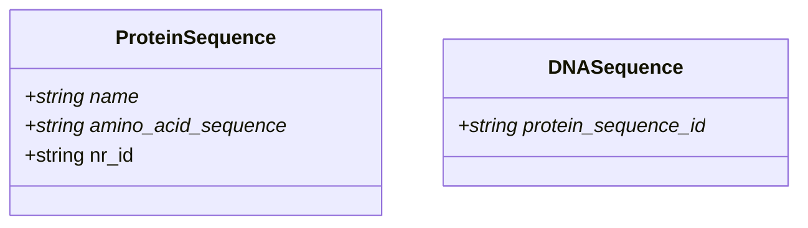

```mermaid
classDiagram
    
    class ProteinSequence {
        +string name*
        +string amino_acid_sequence*
        +string nr_id
    }
    
    class DNASequence {
        +string protein_sequence_id*
    }
    
```