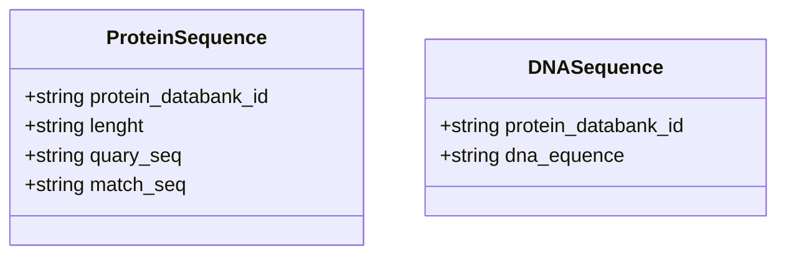

```mermaid
classDiagram
    
    class ProteinSequence {
        +string protein_databank_id
        +string lenght
        +string quary_seq
        +string match_seq
    }
    
    class DNASequence {
        +string protein_databank_id
        +string dna_equence
    }
    
```